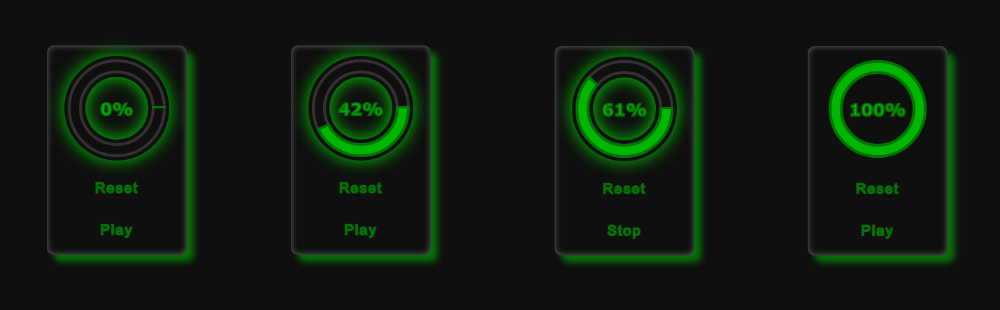

  <h1><b>🧰⚙️🔮 Mini Loading Screen With SVG</b></h1>
  <h6>by <i>FranciscoCharles</i></h6>

Este é apenas um resultado prático do uso de SVG para criar uma
animação simples de carregamento. O objetivo foi criar uma animação fluida e bem posicionada
dentro do elemento container. Para adicionar interação com a animação de carregamento
fiz uso do javascript para adicionar esse tipo de dinâmicidade atravez de dois botões, um para resetar o estado de carregamento e outro para parar e continuar a animação.

    
     
    <h6>
        Figure 1 - alguns estagios da animação e forma do botão.
    </h6>

# <a name=index>Indice📚</a>

- [**Técnologias usadas**](#tecno)
- [**Licença do projeto**](#license)

# **<a name=tecno>🔮🔮🔮 Técnologias usadas </a>** <h6>[voltar ao indice](#index)</h6>

+ **HTML**
+ **CSS**
+ **JS Puro**

# **<a name=license>Licença</a>**  <h6>[voltar ao indice](#index)</h6>

Para mais informações sobre a licença deste projeto, leia o arquivo <a href="./LICENSE" title="go to license file">LICENSE</a>.

---

    Copyright © 2021 <b>FranciscoCharles</b>

